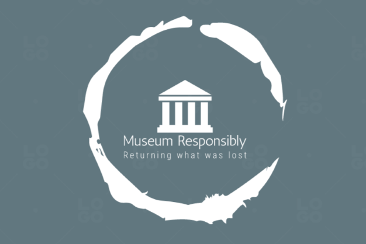

{:height="300px" width="500px"}
# Ethics of Museums 

A popular discussion within the art and artifact community right now is the ethics of museums. Should they be allowed to host artifacts from other countries especially when a lot of those artifacts were stolen from their native countries? 

## Why it's So Wrong
The British Museum cares for over 6,000 bodies from Ancient Egypt and other regions and time periods. Many of these countries have begun asking for the bodies of their deceased back, or other artifacts such as vases, paintings, or sculptures. 

Many of these artworks, especially Egyptian, were never meant to be displayed. In ancient Egypt art and carvings on graves/tombs/etc was reserved for a funerary practice not to be viewed by the living. So the debate of ethics around digging up and displaying bodies and private ceremonial art to millions of people is being brought to light as highly disrespectful. 

Luckily, many of these museums have begun returning artifacts to their native countries. 

## The Other Side of the Coin 
With the good, comes some bad. 
The concern expressed by many museums is that, if they return all their artifacts, what will they have left to display? 
This a true and legitimate concern. How do you respect the artifacts in your museums, and the cultures they come from and represent in an ethical way, and still have artifacts to show and display. 

A few proposals have suggested art trades, giving peices of our art to other countries to display. Or another proposal, the home country owns the artifact, but countries like the U.S are given special permission to display them for two, five, to however many years they see fit. That way if the country of the artifacts origin asks for it's return it can be done so respectfully. 

## More Info 

Here are links to some articles about the ethics of artifacts and museums: 

[Should Museums Return Looted Artifacts to Their Countries of Origin?]

[Dozens of artifacts seized from the Metropolitan Museum of Art]

[Museums and looted art: the ethical dilemma of preserving world cultures]

[Should Museums Return Looted Artifacts to Their Countries of Origin?]: https://www.nytimes.com/2020/10/16/learning/should-museums-return-looted-artifacts-to-their-countries-of-origin.html
[Dozens of artifacts seized from the Metropolitan Museum of Art]: https://www.cnn.com/style/article/met-museum-artifacts-seized-new-york-looting/index.html
[Museums and looted art: the ethical dilemma of preserving world cultures]: https://www.theguardian.com/culture/2015/jun/29/museums-looting-art-artefacts-world-culture
---
Sponsored by the Museum Responsibility Project
